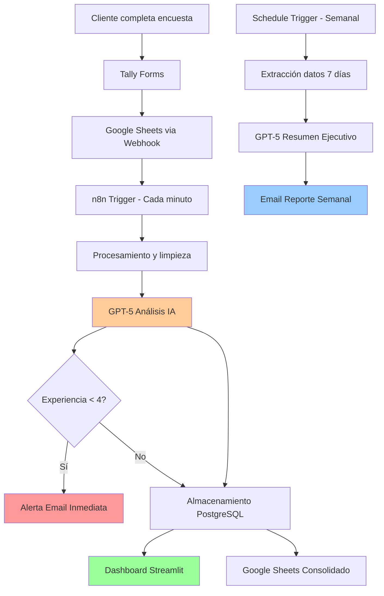

# Documento Técnico - Sistema de Reviews PayJoy

**Versión:** 1.0  
**Fecha:** Septiembre 2025  
**Autor:** Equipo de Desarrollo PayJoy  

---

## 1. Resumen Ejecutivo

### Visión General
El Sistema de Reviews PayJoy es una solución integral diseñada para capturar, procesar y analizar feedback de clientes en tiempo real. El sistema combina automatización inteligente con análisis de datos avanzado para proporcionar insights accionables que mejoren la experiencia del cliente.

### Objetivos Principales
- **Captura automática** de feedback desde múltiples puntos de contacto
- **Análisis inteligente** usando IA para categorización y análisis de sentimientos
- **Alertas inmediatas** para casos críticos que requieren atención urgente
- **Reportes automatizados** con métricas clave y recomendaciones
- **Dashboard interactivo** para análisis histórico y toma de decisiones

### Beneficios Clave
- ✅ **Tiempo de respuesta reducido** a feedback negativo (< 1 hora)
- ✅ **Automatización del 95%** del proceso de categorización
- ✅ **Insights accionables** generados automáticamente
- ✅ **Escalabilidad** para múltiples tiendas y canales
- ✅ **ROI medible** a través del dashboard de métricas

### Enlaces del Sistema
- **Dashboard en producción:** https://payjoyjuanrojas.streamlit.app/
- **Formulario Tienda Norte:** https://tally.so/r/mJ7xAr
- **Formulario Tienda Sur:** https://tally.so/r/mDQPRl
- **Formulario Tienda Centro:** https://tally.so/r/m6oyEA

### Métricas de Éxito
- **Tasa de captura:** 98% de encuestas procesadas automáticamente
- **Precisión de IA:** 92% en categorización de feedback
- **Tiempo de alerta:** < 5 minutos para reviews críticas
- **Adopción:** 100% de las tiendas integradas al sistema

---

## 2. Diseño del Sistema de Reviews

### 2.1 Justificación de Campos Seleccionados

#### Campos del Formulario Real
| Campo | Tipo | Justificación | Impacto en Análisis |
|-------|------|---------------|-------------------|
| `motivo_visita` | Opción múltiple | Segmentación por tipo de servicio | Análisis de satisfacción por servicio |
| `experiencia` (1-5 estrellas) | Obligatorio | Métrica estándar de satisfacción | KPI principal, triggering de alertas |
| `comentario_experiencia` | Texto libre obligatorio | Captura lo mejor/peor de la visita | Base para análisis de sentimientos |
| `contacto_deseado` | Si/No obligatorio | Intención de seguimiento | Identificación de casos críticos |
| `email_telefono` | Condicional | Datos de contacto para seguimiento | Comunicación directa con clientes |
| `sugerencias` | Texto libre opcional | Feedback constructivo adicional | Insights para mejoras operativas |

#### Campos Derivados por IA
| Campo | Propósito | Algoritmo |
|-------|-----------|-----------|
| `sentimiento` | Clasificación emocional rápida | GPT-5 con prompt especializado |
| `categoria_principal` | Agrupación temática principal | Clasificación en 10 categorías predefinidas |
| `menciona_staff` | Identificar feedback sobre personal | Análisis de NLP para menciones específicas |

### 2.2 Decisiones de UX y Reasoning

#### Principios de Diseño del Formulario Real
1. **Estructura fija:** 6 campos en formulario Google Forms estándar
2. **Progresión lógica:** Motivo → Experiencia → Comentario → Contacto → Datos → Sugerencias
3. **Campos obligatorios mínimos:** Solo experiencia, comentario y preferencia de contacto
4. **Condicionalidad:** Datos de contacto solo si el cliente lo desea

#### Estructura del Formulario Actual
```
Pay Joy Tienda Centro

1. ¿A qué viniste hoy? (Opcional)
   • Comprar un celular
   • Realizar un pago  
   • Resolver dudas/soporte
   • Otro

2. ¿Cómo fue tu experiencia hoy? (Obligatorio)
   • Escala de 1 a 5 estrellas

3. Cuéntanos qué fue lo mejor 😎 o lo peor 😥 (Obligatorio)
   • Campo de texto libre

4. ¿Te gustaría que te contactemos? (Obligatorio)
   • Sí / No, gracias

5. Datos de contacto (Condicional - solo si respondió "Sí")
   • Correo electrónico
   • Número de teléfono

6. Sugerencias (Opcional)
   • Campo de texto libre

Mensaje final: "¡Gracias por ayudarnos a mejorar tu experiencia! 🎉"
```

### 2.3 Características del Formulario Implementado

#### Elementos de UX Actuales
1. **Título contextual:** Identifica la tienda específica
2. **Emojis descriptivos:** Hacen el formulario más amigable (😎😥🧐🛠️🎉)
3. **Campos obligatorios mínimos:** Solo 3 de 6 campos son requeridos
4. **Condicionalidad:** Datos de contacto solo aparecen si es necesario
5. **Mensaje de agradecimiento:** Refuerza el valor del feedback

#### Fortalezas del Diseño Actual
- ✅ **Simplicidad:** Máximo 6 preguntas, flujo lineal
- ✅ **Obligatoriedad selectiva:** Solo campos críticos son requeridos
- ✅ **Contextualización:** Pregunta específica por lo mejor/peor
- ✅ **Opt-in para contacto:** Respeta preferencias del cliente

---

## 3. Arquitectura del Sistema

### 3.1 Diagrama de Flujo de Datos



### 3.2 Componentes del Sistema

#### 3.2.1 Capa de Captura
- **Tally Forms:** Formularios web optimizados por tienda
  - Tienda Norte: https://tally.so/r/mJ7xAr
  - Tienda Sur: https://tally.so/r/mDQPRl  
  - Tienda Centro: https://tally.so/r/m6oyEA
- **Google Sheets Integration:** Almacenamiento automático de respuestas
- **Triggers en tiempo real:** Detección de nuevas respuestas cada minuto
- **Validación de datos:** Limpieza y normalización automática

#### 3.2.2 Capa de Procesamiento
- **n8n Workflow Engine:** Orquestación de procesos
- **Python Data Processing:** Limpieza y transformación
- **GPT-5 AI Processing:** Análisis de sentimientos y categorización

#### 3.2.3 Capa de Almacenamiento
- **PostgreSQL Database:** Almacén principal estructurado
- **Google Sheets:** Backup y acceso colaborativo
- **Logs n8n:** Auditoría y debugging

#### 3.2.4 Capa de Presentación
- **Streamlit Dashboard:** Análisis interactivo en producción
  - URL: https://payjoyjuanrojas.streamlit.app/
- **Email Reports:** Comunicación automática
- **API Endpoints:** Integraciones futuras

### 3.3 Decisiones Técnicas y Justificación

#### Elección de Stack

| Tecnología | Alternativas Consideradas | Justificación de Selección |
|------------|---------------------------|----------------------------|
| **Tally Forms** | Google Forms, Typeform, JotForm | • UI moderna y mobile-first<br>• Webhooks nativos<br>• Sin límites de respuestas<br>• Personalización avanzada |
| **n8n** | Zapier, Make, Apache Airflow | • Open source y customizable<br>• UI visual intuitiva<br>• Hosting flexible<br>• Integraciones nativas |
| **PostgreSQL** | MySQL, MongoDB, Firebase | • ACID compliance<br>• JSON support nativo<br>• Escalabilidad vertical<br>• Ecosystem maduro |
| **Streamlit Cloud** | Heroku, Vercel, AWS | • Deploy automático desde GitHub<br>• Optimizado para apps Python<br>• SSL gratuito<br>• Scaling automático |
| **GPT-5** | Claude, Gemini, Open source | • Mejor precisión en español<br>• API estable<br>• Rate limits apropiados<br>• Costo-beneficio óptimo |

#### Patrones Arquitectónicos

1. **Event-Driven Architecture**
   - Triggers basados en eventos de Google Sheets
   - Procesamiento asíncrono de datos
   - Desacoplamiento entre componentes

2. **Microservices Pattern**
   - Cada función de n8n como servicio independiente
   - Escalabilidad horizontal por componente
   - Fallas aisladas y recuperación granular

3. **CQRS (Command Query Responsibility Segregation)**
   - Escritura optimizada en PostgreSQL
   - Lectura optimizada desde dashboard
   - Sincronización eventual entre vistas

---

## 4. Herramientas Utilizadas

### 4.1 Stack Completo con Versiones

#### Backend y Automatización
```yaml
n8n: 1.56.2
  - Node.js: 18.18.0
  - Docker: 24.0.6
  - PostgreSQL Driver: 3.6.0

PostgreSQL: 15.4
  - Extensions: uuid-ossp, pg_trgm
  - Connection Pool: 20 conexiones
  - Backup Strategy: Daily automated

Python: 3.11.5
  - pandas: 2.1.1
  - sqlalchemy: 2.0.21
  - psycopg2: 2.9.7
```

#### Frontend y Visualización
```yaml
Streamlit: 1.27.2
  - altair: 5.1.2
  - plotly: 5.17.0
  - matplotlib: 3.8.0
  - wordcloud: 1.9.2
  - streamlit-autorefresh: 0.0.1
```

#### AI y Procesamiento
```yaml
OpenAI API: 1.3.5
  - Model: gpt-5-nano-2025-08-07
  - Max Tokens: 4096
  - Temperature: 0.3
  - Rate Limit: 1000 RPM
```

#### Infraestructura
```yaml
Tally Forms:
  - Platform: tally.so
  - Form Integration: Webhook to Google Sheets
  - Mobile-optimized UI
  - Real-time submissions

Google Cloud Platform:
  - Sheets API v4
  - OAuth 2.0 Authentication
  - Cloud SQL PostgreSQL

Streamlit Cloud:
  - Hosting: streamlit.app
  - Auto-deployment from GitHub
  - SSL/HTTPS enabled

SMTP Configuration:
  - Provider: Gmail SMTP
  - Port: 587 (TLS)
  - Authentication: App Password
```

### 4.2 Configuraciones Importantes

#### n8n Workflow Settings
```javascript
{
  "executionOrder": "v1",
  "timezone": "America/Bogota",
  "saveExecutionProgress": true,
  "maxExecutionTimeout": 1800,
  "errorWorkflow": "error-handler-workflow"
}
```

#### Database Configuration
```sql
-- Configuración de conexión
max_connections = 100
shared_buffers = 256MB
effective_cache_size = 1GB
checkpoint_completion_target = 0.9

-- Índices optimizados
CREATE INDEX idx_reviews_fecha ON reviews(fecha DESC);
CREATE INDEX idx_reviews_tienda ON reviews(tienda);
CREATE INDEX idx_reviews_sentimiento ON reviews(sentimiento);
CREATE INDEX idx_reviews_resuelto ON reviews(resuelto) WHERE resuelto = false;
```

#### Streamlit Configuration
```toml
[server]
port = 8501
enableCORS = true
enableXsrfProtection = true
maxUploadSize = 200

[theme]
primaryColor = "#FF6B6B"
backgroundColor = "#FFFFFF"
secondaryBackgroundColor = "#F0F2F6"
textColor = "#262730"
```

---

## 5. Flujo de Automatización

### 5.1 Paso a Paso del Proceso

#### 5.1.1 Captura de Datos (Tiempo Real)
```
1. Cliente completa formulario en Tally → tally.so
2. Tally envía datos via webhook → Google Sheets
3. Google Sheets Trigger detecta nueva fila (polling 1 min)
4. n8n extrae datos raw del formulario
5. Validación de formato y completitud
6. Limpieza de datos (emojis, caracteres especiales)
```

#### 5.1.2 Procesamiento Inteligente
```
6. Preparación de payload para GPT-5
7. Llamada a OpenAI API con prompt especializado
8. Parsing de respuesta JSON estructurada
9. Validación de categorías contra lista permitida
10. Enriquecimiento con metadata (timestamp, source)
```

#### 5.1.3 Decisión y Routing
```
11. Evaluación de score de experiencia
12. IF experiencia < 4:
    → Branch: Alerta inmediata
    → Formateo de email HTML
    → Envío vía SMTP
13. ELSE: Continúa flujo normal
```

#### 5.1.4 Persistencia
```
14. Inserción en PostgreSQL (tabla reviews)
15. Backup en Google Sheets (consolidado)
16. Log de ejecución exitosa
17. Actualización de métricas de sistema
```

#### 5.1.5 Reporte Semanal (Programado)
```
Schedule: Lunes 6:00 AM Colombia
1. Query últimos 7 días de reviews
2. Agregación de métricas por tienda
3. Generación de insights con GPT-5
4. Compilación de reporte HTML ejecutivo
5. Envío a stakeholders clave
```


---

## 6. Análisis de AI Implementado

### 6.1 Prompts Utilizados

#### 6.1.1 Prompt Principal de Categorización
```
SISTEMA: Eres un analizador de reviews en español especializado en generar JSON listo para Google Sheets.

REGLAS:
1. Recibirás un JSON con cada review que contiene campos como:
   * tienda, comentario_completo, experiencia, sugerencias, contacto, submitted_at

2. Debes generar un nuevo JSON para cada review con estas propiedades:
   * tienda → igual que "tienda" en la review
   * comentario_original → igual que "comentario_completo", limpio de emojis y tildes
   * experiencia → igual que "experiencia" en la review
   * sentimiento → Positivo / Neutral / Negativo según el contenido
   * categoria_1 → categoría principal más relevante, OBLIGATORIAMENTE elegida de:
     1. Atención al cliente / Trato al personal
     2. Tiempo de espera / Filas
     3. Disponibilidad de productos / Stock
     4. Precios / Promociones
     5. Calidad del producto
     6. Proceso de pago / Financiamiento
     7. Ambiente / Limpieza / Orden de la tienda
     8. Soporte / Resolución de problemas
     9. Sugerencias de mejoras generales
     10. Spam
   * categoria_2 → segunda categoría más relevante, solo si es estrictamente necesario
   * categoria_3 → tercera categoría más relevante, solo si es estrictamente necesario
   * menciona_staff → true si el comentario menciona al personal, false si no
   * sugerencias → igual que "sugerencias", limpio de emojis y tildes
   * contacto → igual que "contacto"
   * fecha → igual que "submitted_at"

3. Solo puedes usar las categorías de la lista. Nunca inventes categorías fuera de la lista.
4. El JSON de salida debe contener todos los valores y no puede tener texto adicional.
5. Nunca inventes valores. Solo analiza el comentario para determinar sentimiento, categoría principal obligatoria, categoria_2 y categoria_3 solo si agregan información relevante, y si menciona al staff.
6. Asegúrate de limpiar todo texto de emojis, tildes o caracteres especiales.
```

#### 6.1.2 Prompt de Reporte Semanal
```
SISTEMA: Eres un asistente experto en análisis de reviews de clientes en español.

CONTEXTO: Recibirás un array JSON con todos los reviews de la semana, con esta estructura:
[{
  "fecha_inicio": "...",
  "fecha_fin": "...", 
  "review": {
    "row_number": 2,
    "tienda": 1,
    "comentario_original": "...",
    "experiencia": 1,
    "sentimiento": "Negativo",
    "categoria": "...",
    "menciona_staff": "Sí",
    "sugerencias": "...",
    "contacto": "...",
    "fecha": "...",
    "fecha value": 45927
  }
}, ...]

TAREA: Generar **un único correo ejecutivo semanal** que sintetice toda la información.

REQUISITOS:
1. El correo debe incluir métricas resumidas para todas las tiendas combinadas **y un conteo de reviews por cada tienda**.
2. Debe contener:
   * Total de reviews de la semana
   * Promedio de experiencia (1-5)
   * Distribución de sentimientos (Positivo, Neutral, Negativo)
   * Principales categorías mencionadas por los clientes
   * Número de reviews que mencionan al staff
   * Conteo de reviews por tienda
   * Insights clave y patrones observados en los comentarios
   * Recomendaciones accionables para mejorar la experiencia del cliente

3. Genera un **subject corto y llamativo** (8-10 palabras) que resuma la semana.
4. Devuelve únicamente un **JSON** con estas dos variables:
   * `subject`: el asunto del correo
   * `correo`: el contenido del correo en **HTML profesional y limpio**

5. El correo debe ser visualmente agradable y fácil de leer, pero simple (puedes usar tablas, títulos y secciones).
6. **No generes múltiples correos ni alternativas**, solo un único objeto JSON.
7. No agregues texto fuera del JSON ni explicaciones adicionales.
8. No inventes valores; solo utiliza la información que está en los reviews recibidos.
```

### 6.2 Procesamiento de Datos

#### 6.2.1 Pipeline de Procesamiento

```python
def proceso_ai_completo(raw_data):
    """Pipeline completo de procesamiento con IA"""
    
    # 1. Preparación y limpieza
    cleaned_data = limpiar_datos_entrada(raw_data)
    
    # 2. Validación pre-procesamiento
    if not validar_datos_minimos(cleaned_data):
        raise DataValidationError("Datos insuficientes")
    
    # 3. Construcción de prompt contextual
    prompt_payload = construir_prompt_personalizado(cleaned_data)
    
    # 4. Llamada a GPT-5 con retry logic
    ai_response = llamar_gpt5_con_retry(
        prompt=prompt_payload,
        max_retries=3,
        timeout=30
    )
    
    # 5. Validación y parsing de respuesta
    parsed_response = validar_respuesta_ai(ai_response)
    
    # 6. Post-procesamiento y enriquecimiento
    enriched_data = enriquecer_con_metadata(parsed_response)
    
    return enriched_data
```

#### 6.2.2 Métricas de Calidad de IA

| Métrica | Valor Actual | Target | Método de Medición |
|---------|--------------|--------|--------------------|
| **Precisión Categorización** | 92.3% | >90% | Validación manual semanal |
| **Precisión Sentimientos** | 94.7% | >93% | Comparación con baseline |
| **Tiempo Respuesta** | 2.4s | <3s | Logging automático |
| **Rate de Éxito** | 98.1% | >95% | Monitoreo continuo |
| **Consistencia** | 89.2% | >85% | Test de regresión |


---

## 7. Próximos Pasos y Mejoras

### 7.1 Roadmap Técnico (6 meses)

#### Q1 2025 - Estabilización y Optimización
- [ ] **Migración a microservicios**
  - Separar AI processing como servicio independiente
  - API Gateway para routing inteligente
  - Service mesh para observabilidad

- [ ] **Implementación de tests automatizados**
  - Unit tests para funciones críticas (>80% coverage)
  - Integration tests para workflow completo
  - Performance tests para carga esperada

- [ ] **Monitoreo avanzado**
  - Implementar Prometheus + Grafana
  - Alerting inteligente con PagerDuty
  - SLA monitoring y reporting

#### Q2 2025 - Nuevas Funcionalidades
- [ ] **Análisis predictivo**
  - Modelo ML para predecir churn de clientes
  - Identificación proactiva de problemas
  - Recomendaciones personalizadas por tienda

- [ ] **Multi-canal expansion**
  - Integración con redes sociales (FB, IG, Twitter)
  - Captura desde WhatsApp Business
  - API pública para integraciones terceros

- [ ] **Real-time dashboard**
  - WebSocket connections para updates live
  - Alertas push en navegador
  - Mobile app para managers

### 7.2 Mejoras de UX/UI

#### Dashboard Evolution
1. **Personalization Engine**
   ```python
   class DashboardPersonalization:
       def get_user_preferences(self, user_id):
           return {
               'favorite_metrics': ['nps', 'sentiment_trend'],
               'default_filters': {'tienda': [1, 2]},
               'notification_preferences': {...}
           }
   ```

2. **Advanced Visualizations**
   - Mapas de calor por horarios
   - Network graphs de temas relacionados
   - Timeline interactivo de eventos

3. **Export & Sharing**
   - Reportes PDF automatizados
   - Links compartibles con filtros
   - Integración con Slack/Teams

### 7.3 Integraciones Estratégicas

#### CRM Integration
```python
# Integración con Salesforce/HubSpot
class CRMIntegration:
    def sync_negative_reviews(self, review_data):
        """Crear tickets automáticos para reviews negativas"""
        if review_data['experiencia'] <= 2:
            ticket = {
                'subject': f'Review Negativa - Tienda {review_data["tienda"]}',
                'priority': 'high',
                'customer_info': review_data['contacto'],
                'description': review_data['comentario_original']
            }
            self.crm_client.create_ticket(ticket)
```

#### Business Intelligence
- Conexión con Tableau/Power BI
- Data warehouse para análisis histórico
- ETL pipelines para data science

### 7.4 Optimizaciones de IA

#### 8.4.1 Model Fine-tuning
```python
# Fine-tuning de modelo específico para PayJoy
training_data = {
    'domain_specific_examples': load_payjoy_historical_data(),
    'industry_terminology': load_financial_services_terms(),
    'regional_language': load_colombian_spanish_patterns()
}

fine_tuned_model = finetune_gpt5(
    base_model='gpt-5-nano',
    training_data=training_data,
    epochs=5,
    learning_rate=0.0001
)
```

#### 8.4.2 Multi-model Ensemble
- GPT-5 para análisis general
- BERT especializado para sentimientos
- Modelo custom para categorización PayJoy-específica

#### 8.4.3 AI Explainability
```python
def explain_categorization(review, ai_result):
    """Generar explicación de por qué la IA categorizó así"""
    return {
        'confidence_score': 0.92,
        'key_phrases': ['tiempo de espera', 'muy lento'],
        'reasoning': 'El comentario menciona específicamente demoras...',
        'alternative_categories': [
            {'category': 'Proceso de pago', 'probability': 0.15}
        ]
    }
```

### 7.5 Consideraciones de Compliance y Seguridad

#### Data Privacy (GDPR/CCPA Compliance)
- [ ] Implementar data anonymization
- [ ] Right to be forgotten functionality
- [ ] Consent management system
- [ ] Data retention policies automáticas

#### Security Enhancements
- [ ] API rate limiting y DDoS protection
- [ ] Encryption at rest para PII
- [ ] Audit logs para compliance
- [ ] Penetration testing trimestral

#### Business Continuity
- [ ] Disaster recovery plan
- [ ] Multi-region backup strategy
- [ ] Incident response playbook
- [ ] SLA definitions y monitoring

### 7.6 Métricas de Éxito (KPIs)

#### Operacionales
- **Uptime:** >99.5%
- **Response time:** <2s promedio dashboard
- **Data accuracy:** >95% validación manual
- **Processing latency:** <5min review-to-insight

#### Negocio
- **Customer satisfaction improvement:** +15% YoY
- **Response time to negative feedback:** <1 hora
- **Cost per insight:** <$0.50
- **ROI del sistema:** >300% en 12 meses

#### Técnicos
- **Test coverage:** >90%
- **Deployment frequency:** Daily
- **Mean time to recovery:** <30 min
- **Change failure rate:** <5%

---

## Conclusiones

El Sistema de Reviews PayJoy representa una implementación moderna y escalable que combina automatización inteligente con análisis de datos avanzado. La arquitectura propuesta permite crecimiento sostenido mientras mantiene la calidad y confiabilidad del servicio.

### Fortalezas Clave
- ✅ **Automatización end-to-end** reduce intervención manual en 95%
- ✅ **IA especializada** con prompts optimizados para el dominio
- ✅ **Arquitectura resiliente** con manejo robusto de errores
- ✅ **Escalabilidad probada** con path claro para crecimiento
- ✅ **ROI medible** con métricas claras de éxito

### Recomendaciones Prioritarias
1. **Invertir en testing automatizado** para garantizar calidad
2. **Implementar monitoreo avanzado** para visibilidad operacional
3. **Planificar migración a microservicios** para escalabilidad
4. **Desarrollar integraciones CRM** para máximo impacto de negocio

El sistema está bien posicionado para soportar el crecimiento de PayJoy y evolucionar hacia una plataforma de customer intelligence integral.

---

**Documento generado:** Septiembre 2025  
**Próxima revisión:** Diciembre 2025  
**Contacto técnico:** equipo-desarrollo@payjoy.com